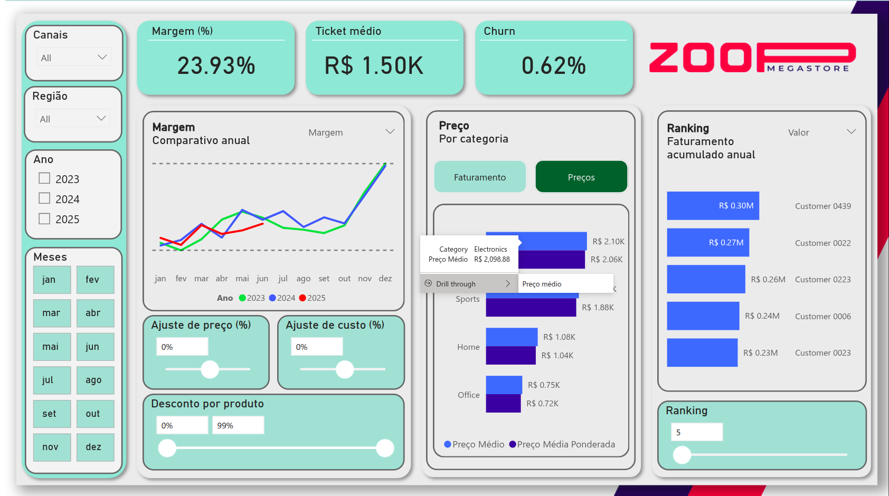
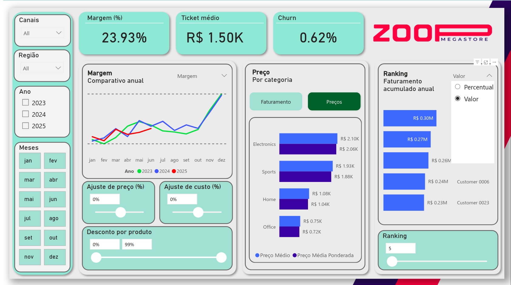
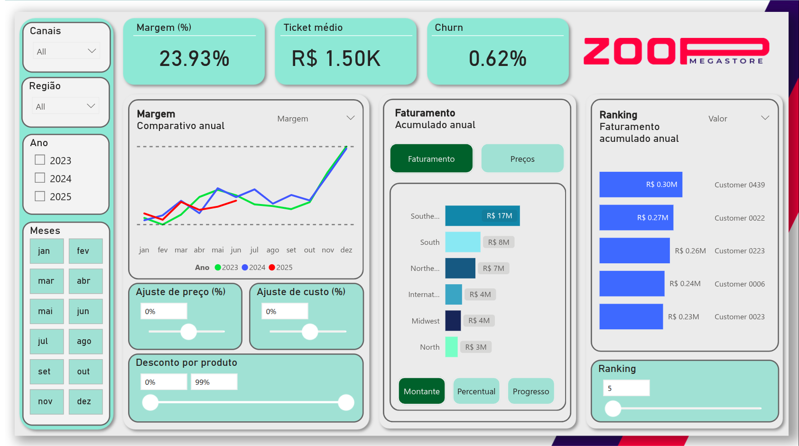

# Zoop Megastore

## Visão Geral

Como parte do curso de **"Power BI: análises avançadas com DAX"**, a alura criou o seguinte cenário: O time da **Zoop Megastore**, empresa que está atuando Estados Unidos, deseja extrair inteligência dos dados através das funções DAX do Power BI. Para isso, a equipe disponibilizou a planilha de Excel com o processo de ETL concluído. O foco inicial é preparar as medidas necessárias e, posteriormente, criar o dashboard que atenderá as perguntas da equipe. 

---

## Objetivo do Projeto

Gerar insights estratégicos e acionáveis para a equipe da Zoop Megastore, com base nos dados de vendas dos anos de 2023, 2024 e 2025.
O relatório foi estruturado para permitir análises dinâmicas e comparativas, contemplando os seguintes pilares:

### Vendas
O relatório deve permitir:
- Analisar o faturamento no canal Online.
- Identificar o faturamento em transações com desconto superior a 15%.
- Acompanhar o faturamento acumulado ao longo do mês e do ano (MTD e YTD), permitindo avaliar o desempenho atual em relação ao período completo.

### Receita
- Visualização da receita mês a mês, permitindo identificar tendências de crescimento ou retração.
- Alternância dinâmica entre indicadores no mesmo componente visual, possibilitando análise de:
    - Receita
    - Margem
    - Ticket médio
- Análise da receita da filial Midwest, bem como sua participação percentual no total da empresa, independentemente dos filtros aplicados.
- Monitoramento dos seguintes indicadores estratégicos:
    - Margem percentual
    - Ticket médio
    - Churn

### Preços
A análise de preços deve permitir:
- Cálculo da média de preço simples e da média ponderada por quantidade vendida, considerando os descontos aplicados, a fim de refletir o preço efetivamente praticado no mercado.
- Simulação de cenários estratégicos por meio de:
    - Alteração do preço médio dos produtos
    - Alteração dos custos
    - Avaliação do impacto dessas mudanças na receita e margem

### Clientes
O relatório deve permitir:
- Geração de ranking dinâmico dos Top 5, 10 ou 15 clientes em termos de faturamento no ano atual.
- Identificação da participação percentual de cada cliente na receita total da empresa, permitindo avaliar concentração e dependência de receita. 

---

## Estrutura do Projeto

```
EcoFuelLog/
├── Dados/
│   ├── Brasil.xlsx
│   └── Estados Unidos.xlsx
├── Relatórios/
│   ├── Zoop - Relatório de Vendas - Brasil.pbix
│   └── Zoop - Relatório de Vendas - USA.pbix
├── Screenshots/
│   ├── 01.png
│   ├── 02.png
│   ├── 03.png
│   ├── 04.png
│   └── 05.png
├── Utils/
│   ├── Fundo editável Zoop.pptx
│   ├── Fundo Zoop.png
│   ├── Fundo Zoop 2.png
│   ├── Fundo Zoop 3.png
│   └── bg-powerbi.png
└── README.md
```

---

## KPIs
- Churn
- Custos
- Faturamento: total, acumulado, acumulado percentual, taxa de crescimento e ranking
- Margem e margem percentual
- Média aritmética e ponderada dos preços com descontos aplicados
- Ticket médio

---

## Estrutura Analítica do Projeto
O projeto foi desenvolvido com foco em:
- Comparabilidade entre anos (2023, 2024 e 2025)
- Análise temporal (mensal e acumulada)
- Segmentação por canal e região
- Indicadores financeiros estratégicos
- Simulação de cenários (análise preditiva básica)
- Análise de concentração de clientes

---

## Conclusões -- Desempenho de Faturamento e Clientes

### 1. Visão Geral do Faturamento

A análise concentrou-se no primeiro semestre de 2025, considerando que
os dados disponíveis se estendem até junho.

O faturamento acumulado do período apresentou valores próximos aos anos
anteriores:

-   **2023:** R\$ 42,6 milhões\
-   **2024:** R\$ 43,4 milhões\
-   **2025:** R\$ 41,8 milhões

A diferença entre o melhor e o pior desempenho (2024 vs. 2025) foi de
aproximadamente **R\$ 1,6 milhão**.

Apesar da proximidade no acumulado, a análise mensal revelou um ponto de
atenção:\
A partir do segundo trimestre de 2025 houve desaceleração significativa
nas vendas, especialmente nos meses de maio e junho.

No primeiro trimestre, o desempenho estava alinhado aos anos anteriores:

-   **2023:** R\$ 19,9 milhões\
-   **2024:** R\$ 19,8 milhões\
-   **2025:** R\$ 18,7 milhões

Isso sugere que a deterioração ocorreu mais intensamente no segundo
trimestre.

------------------------------------------------------------------------

### 2. Análise por Canal

No canal Wholesale, observou-se redução relevante no faturamento
acumulado:

-   **2023:** R\$ 15,9 milhões\
-   **2024:** R\$ 16,7 milhões\
-   **2025:** R\$ 14,8 milhões

A diferença aproximada de **R\$ 1,9 milhão** indica que este canal
contribuiu significativamente para a queda geral.

------------------------------------------------------------------------

### 3. Análise Regional (Canal Wholesale)

As regiões **Midwest** e **South** apresentaram desempenho inferior em
2025:

-   **2025:** R\$ 3,7 milhões\
-   **2023:** R\$ 4,6 milhões\
-   **2024:** R\$ 4,2 milhões

Além disso, a região **Southeast** apresentou forte queda no faturamento
mensal em junho:

-   **2025:** R\$ 0,7 milhão\
-   **2023:** R\$ 1,5 milhão\
-   **2024:** R\$ 1,3 milhão

Ao comparar as taxas de crescimento mensal de 2025 vs. 2024 no canal
Wholesale, três regiões apresentaram retração significativa:

-   Internacional\
-   Midwest\
-   Southeast

Nos meses de maio e junho, houve queda aproximada de **38% e 39%**,
respectivamente.

Isso caracteriza possível ruptura estrutural recente, e não apenas
oscilação sazonal.

------------------------------------------------------------------------

### 4. Indicadores Complementares

#### Ticket Médio

O ticket médio de 2025 no primeiro semestre foi o menor entre os três
anos:

-   **2023:** R\$ 1,52 mil\
-   **2024:** R\$ 1,51 mil\
-   **2025:** R\$ 1,44 mil

Em nível mensal, 2025 apresentou o menor ticket médio em quase todos os
meses, exceto março.

Isso indica possível: - Maior volume de vendas com desconto - Mudança no
mix de produtos - Redução de preços médios

------------------------------------------------------------------------

#### Churn

O churn em 2025 foi o mais elevado do período analisado:

-   **2023:** 0,54%\
-   **2024:** 0,62%\
-   **2025:** 0,79%

Embora o percentual seja baixo em termos absolutos, o aumento relativo
pode ter contribuído para a redução da receita líquida.

------------------------------------------------------------------------

### 5. Concentração de Clientes

Os cinco principais clientes de 2025 foram:

  Cliente   Receita (R\$ mil)   Participação
  --------- ------------------- --------------
  0439      300                 0,72%
  0022      270                 0,64%
  0223      260                 0,61%
  0006      240                 0,57%
  0023      230                 0,55%

A participação individual é relativamente baixa, indicando que a receita
não está excessivamente concentrada em poucos clientes --- o que reduz
risco estrutural.

------------------------------------------------------------------------

### Conclusão Executiva

O desempenho de 2025 no primeiro semestre apresenta estabilidade no
acumulado, porém sinais claros de deterioração no segundo trimestre,
especialmente nos meses de maio e junho.

Os principais fatores associados à queda são:

-   Redução do ticket médio
-   Aumento do churn
-   Desempenho inferior no canal Wholesale
-   Queda relevante em regiões específicas (Midwest e Southeast)

O cenário sugere necessidade de investigação adicional sobre:

-   Política de descontos
-   Estratégia de precificação
-   Perda de contratos ou clientes regionais
-   Mudança no mix de vendas

---

## Screenshots

<p align="center">
  
  
  
  
  
</p>

---

## Contexto Acadêmico

Este projeto foi desenvolvido no contexto do curso **"Power BI: análises avançadas com DAX"**, oferecido pela Alura, com foco em problemas reais de negócio e aplicação prática de ferramentas amplamente utilizadas no mercado.

🔗 Certificação: [Power BI: análises avançadas com DAX](https://cursos.alura.com.br/certificate/f019f450-c403-43fa-a6fe-94dba3fae364)

---

## Contexto Acadêmico

- Abordagem orientada a problemas reais de negócio
- Ênfase em métricas, não apenas visualização
- Organização clara e escalável
- Documentação focada em raciocínio analítico

---

## Autor

**Albert Richard M. Lopes** - [Linkedin](https://linkedin.com/in/albert-richard-73983723)

Engenheiro de Computação | Desenvolvedor Android | Analista de Dados em transição
